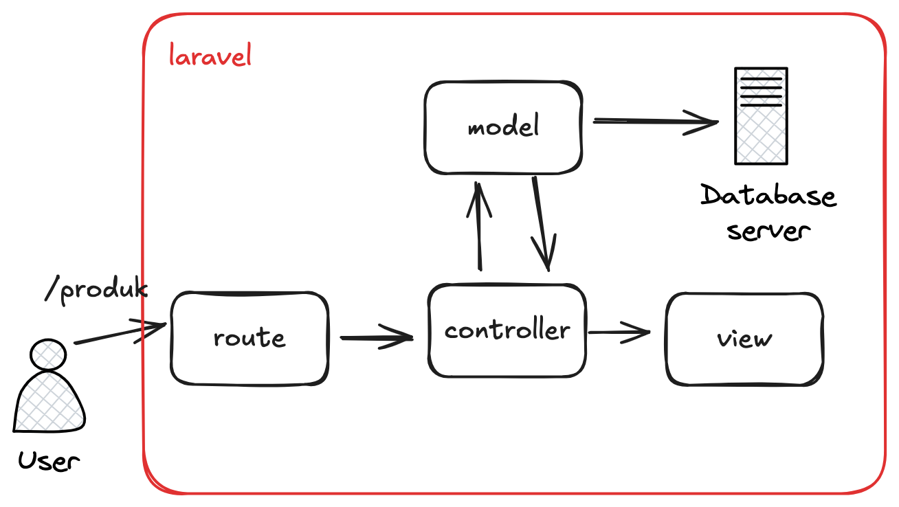

<!-- 
_class: lead 
_paginate: skip
-->

# Pengenalan Full-Stack Development dan Laravel

---

## Pengenalan Konsep Full-Stack Development

Full-stack development adalah istilah yang digunakan untuk menggambarkan seorang developer yang memiliki kemampuan untuk mengembangkan aplikasi baik pada sisi **frontend** (antarmuka pengguna) maupun **backend** (server dan database).

---

## Full-stack Developer

Developer full-stack menguasai teknologi pada kedua sisi ini, yang mencakup:

- Frontend Development
- Backend Development

---

## Frontend Development

Bagian yang dilihat dan berinteraksi langsung dengan pengguna, menggunakan teknologi seperti HTML, CSS, dan JavaScript.

---

## Backend Development

Bagian yang mengelola logika bisnis, interaksi dengan database, dan komunikasi server, menggunakan bahasa seperti PHP, Node.js, atau Python.

--- 

## Kelebihan Full-Stack Development:

- Pengembangan lebih efisien karena satu orang dapat menangani seluruh bagian aplikasi.
- Memiliki pandangan menyeluruh tentang aplikasi, sehingga mudah dalam melakukan debugging dan pengembangan fitur.

---

<!-- 
_class: lead 
_paginate: skip
-->

# Arsitektur MVC (Model-View-Controller)

---

## MVC (Model-View-Controller)

Laravel adalah framework PHP berbasis MVC. MVC adalah pola desain yang memisahkan aplikasi menjadi tiga bagian utama:
- Model
- View
- Controller
 
--- 

##  Model

Bertanggung jawab atas interaksi dengan database, termasuk mengambil dan menyimpan data.

---

## View

Bagian yang menampilkan antarmuka kepada pengguna. Ini biasanya berupa file HTML/CSS yang berinteraksi dengan data yang disediakan oleh Controller.

--- 

## Controller

Menghubungkan Model dan View, menerima input dari pengguna, dan menentukan data apa yang perlu diambil dari Model dan disajikan ke View.

---

## Cara Kerja MVC di Laravel

---

<!-- 
_class: lead 
_paginate: skip
-->

# Instalasi dan Pengaturan Lingkungan Laravel

---

## Langkah-langkah Instalasi Laravel

- Composer
- PHP
- Web Server

---

## Composer

Laravel membutuhkan Composer, sebuah manajer paket untuk PHP, untuk menginstal semua dependensi proyek. Anda dapat menginstalnya melalui situs resmi Composer.

---

## PHP

Laravel membutuhkan PHP minimal versi 8.0. Pastikan PHP sudah terpasang pada mesin lokal.

---

## Web Server

Gunakan server lokal seperti XAMPP atau Laravel Homestead untuk menjalankan aplikasi Laravel secara lokal.
