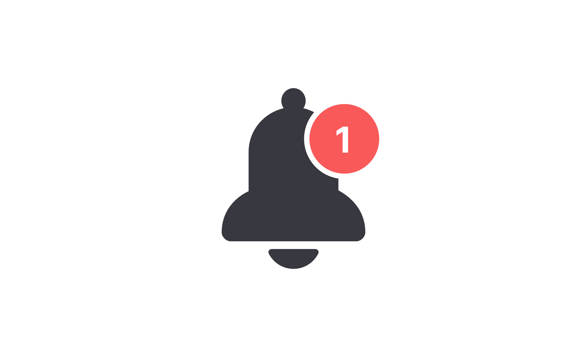

<!-- 
_class: lead 
_paginate: skip
-->

# Notifications



---

## Notifications di Laravel

Notification di Laravel adalah fitur yang memungkinkan aplikasi untuk mengirimkan pesan kepada pengguna melalui berbagai channel seperti email, SMS, Slack, atau database. Notifikasi ini membantu memberikan umpan balik atau informasi penting kepada pengguna.

---

## Jenis-jenis Notification
Laravel mendukung beberapa jenis channel untuk mengirim notifikasi:
- Database Notification: Menyimpan notifikasi di database.
- Mail Notification: Mengirim notifikasi melalui email.
- SMS Notification: Menggunakan layanan seperti Twilio.
- Slack Notification: Mengirim pesan ke Slack.
- Broadcast Notification: Untuk notifikasi real-time.
- https://laravel-notification-channels.com/

---

## Membuat Notification
Gunakan perintah berikut untuk membuat notifikasi baru:
```bash
php artisan make:notification WelcomeNotification
```

---

Struktur file notifikasi berada di `app/Notifications/`. File ini memiliki dua metode utama:
- `via($notifiable)`: Menentukan channel yang digunakan.
- `toMail()`, `toDatabase()`, dll.: Menentukan konten notifikasi untuk channel tertentu.

---

## Email Notification
```php
<?php

namespace App\Notifications;

use Illuminate\Bus\Queueable;
use Illuminate\Notifications\Messages\MailMessage;
use Illuminate\Notifications\Notification;
```

---

```php
class WelcomeNotification extends Notification
{
    use Queueable;

    public function via($notifiable)
    {
        return ['mail'];
    }

    public function toMail($notifiable)
    {
        return (new MailMessage)
                    ->greeting('Halo!')
                    ->line('Selamat datang di aplikasi kami.')
                    ->action('Kunjungi Website', url('/'))
                    ->line('Terima kasih telah bergabung!');
    }
}
```
---

### Mengirimkan Notifikasi
Di controller atau service:
```php
use App\Notifications\WelcomeNotification;
use App\Models\User;

$user = User::find(1);
$user->notify(new WelcomeNotification());
```

---

## Database Notification

---

### Konfigurasi
Pastikan Anda sudah memiliki tabel `notifications`. Jika belum, jalankan:
```bash
php artisan notifications:table
php artisan migrate
```

---

### Menyimpan ke Database
Ubah `via` method di notifikasi:
```php
public function via($notifiable)
{
    return ['database'];
}

public function toDatabase($notifiable)
{
    return [
        'message' => 'Selamat datang di aplikasi kami!',
        'url' => url('/'),
    ];
}
```

---

### Menampilkan Notifikasi
Di controller:
```php
$user = auth()->user();
$notifications = $user->notifications; // Semua notifikasi
$unread = $user->unreadNotifications; // Notifikasi belum dibaca
```
Di view:
```blade
<ul>
    @foreach ($notifications as $notification)
        <li>{{ $notification->data['message'] }}</li>
    @endforeach
</ul>
```

---

## 6. Broadcast Notification

---

### Konfigurasi
Install Laravel Echo dan Pusher:
```bash
composer require pusher/pusher-php-server
npm install --save laravel-echo pusher-js
```

---

Tambahkan channel `broadcast`:
```php
public function via($notifiable)
{
    return ['broadcast'];
}

public function toBroadcast($notifiable)
{
    return [
        'message' => 'Pesan baru untuk Anda!'
    ];
}
```

---

### Mendengarkan Event
Gunakan Laravel Echo di JavaScript:
```javascript
Echo.private(`App.Models.User.${userId}`)
    .notification((notification) => {
        console.log(notification.message);
    });
```

---

## 7. Praktik Terbaik

Gunakan queues untuk meningkatkan kinerja:
```php
public function via($notifiable)
{
    return ['mail', 'database'];
}
```

Tambahkan ke queue:
```php
php artisan queue:work
```

---

- Pastikan hanya mengirimkan notifikasi yang relevan kepada pengguna.
- Gunakan channel yang sesuai dengan preferensi pengguna.

