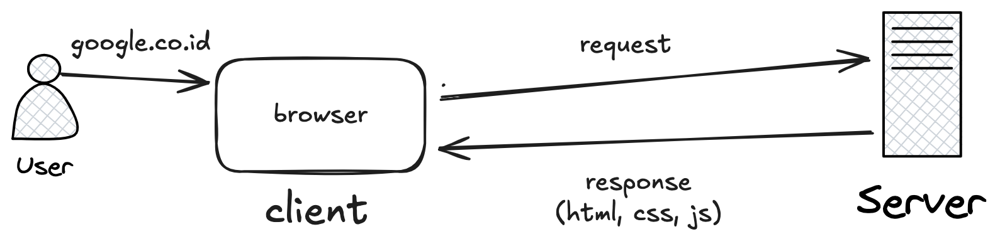

<!-- _class: leading -->

# Routing dan Controller

---

## How the Web Works



---

## HTTP Verbs

- GET
- POST
- PUT
- DELETE

---

## Route Table

|Verb|	URL| Description|
|---|---|---|
|GET| products| Tampilkan semua produk|
|GET| products/create| Tampilkan form create produk|
|POST| products| Menerima request tambah produk|
|GET| products/{product}| Tampilkan satu produk|
|GET| products/{product}/edit| Rubah satu produk|
|PUT/PATCH| products/{product}| Menerima request rubah produk|
|DELETE| products/{product}| Hapus produk|

---

## Route Definition

In a Laravel application, you will define your web routes in routes/web.php.

```php
// routes/web.php
Route::get('/', function () {
    return 'Hello, World!';
});
```

---

## Available Router Methods

```php
Route::get($uri, $callback);
Route::post($uri, $callback);
Route::put($uri, $callback);
Route::patch($uri, $callback);
Route::delete($uri, $callback);
Route::options($uri, $callback);
```
---

## Listing Your Routes

The `route:list` Artisan command can easily provide an overview of all of the routes that are defined by your application

```sh
php artisan route:list
```
---

## Route Parameters

If the route you’re defining has parameters—​segments in the URL structure that are variable—​it’s simple to define them in your route and pass them to your closure

```php
Route::get('users/{id}/friends', function ($id) {
    //
});
```

---

## Optional Route Parameters

You can also make your route parameters optional by including a question mark (?) after the parameter name

```php
Route::get('users/{id?}', function ($id = 'fallbackId') {
    //
});
```

---

## url() Helper

The simplest way to refer to these routes elsewhere in your application is just by their path. There’s a url() global helper to simplify that linking in your views

```php
<a href="<?php echo url('/'); ?>">
// Outputs <a href="http://myapp.com/">
```

---

## Route Name

Laravel also allows you to name each route, which enables you to refer to it without explicitly referencing the URL

```php
// Defining a route with name() in routes/web.php:
Route::get('members/{id}', [MemberController::class, 'show'])
    ->name('members.show');

// Linking the route in a view using the route() helper:
<a href="<?php echo route('members.show', ['id' => 14]); ?>">
```

---

## View

Simple `view()` usage

```php
Route::get('/', function () {
   return view('home');
});
```

---

## Passing variables to views

```php
Route::get('tasks', function () {
    return view('tasks.index')
        ->with('tasks', Task::all());
});

```

---

## Controllers

One easy way to do create controller is with an Artisan command, so from the command line, run the following:

```sh
php artisan make:controller TaskController
```

---

## Simple controller example

```php
<?php

namespace App\Http\Controllers;

class TaskController extends Controller
{
    public function index()
    {
        return 'Hello, World!';
    }
}
```

---

## Route for the simple controller

```php
// routes/web.php
<?php

use Illuminate\Support\Facades\Route;
use App\Http\Controllers\TaskController;

Route::get('/', [TaskController::class, 'index']);
```

---

## Getting User Input

```php
// TaskController.php
...
public function store()
{
    Task::create(request()->only(['title', 'description']));

    return redirect('tasks');
}
```

---

## HTTP Method Spoofing in HTML Forms

To inform Laravel that the form you’re currently submitting should be treated as something other than a POST.

```php
<form action="/tasks/5" method="POST">
    @method('DELETE')
</form>
```

---

## CSRF Protection

A cross-site request forgery is when one website pretends to be another. The goal is for someone to hijack your users’ access to your website by submitting forms from their website to your website via the logged-in user’s browser.

```php
<form action="/tasks/5" method="POST">
    @csrf
</form>
```

---

## Redirects

```php
// Using the global helper to generate a redirect response
Route::get('redirect-with-helper', function () {
    return redirect()->to('login');
});

// Using the global helper shortcut
Route::get('redirect-with-helper-shortcut', function () {
    return redirect('login');
});

// Using the facade to generate a redirect response
Route::get('redirect-with-facade', function () {
    return Redirect::to('login');
});

// Using the Route::redirect shortcut
Route::redirect('redirect-by-route', 'login');
```

---

## redirect()->route()

```php
Route::get('redirect', function () {
    return redirect()->route('conferences.index');
});
```